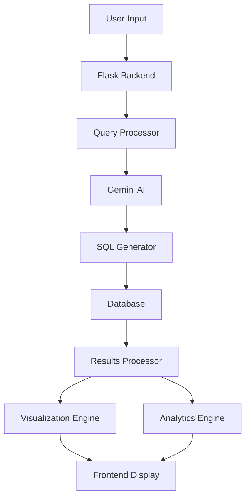
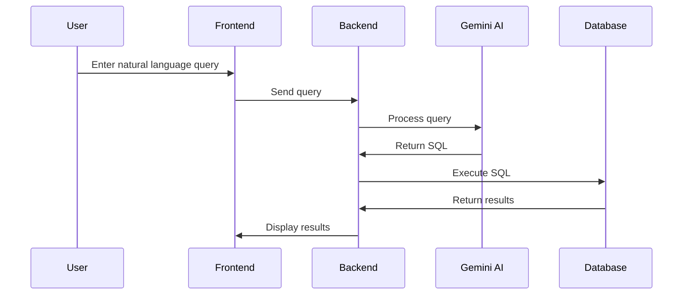
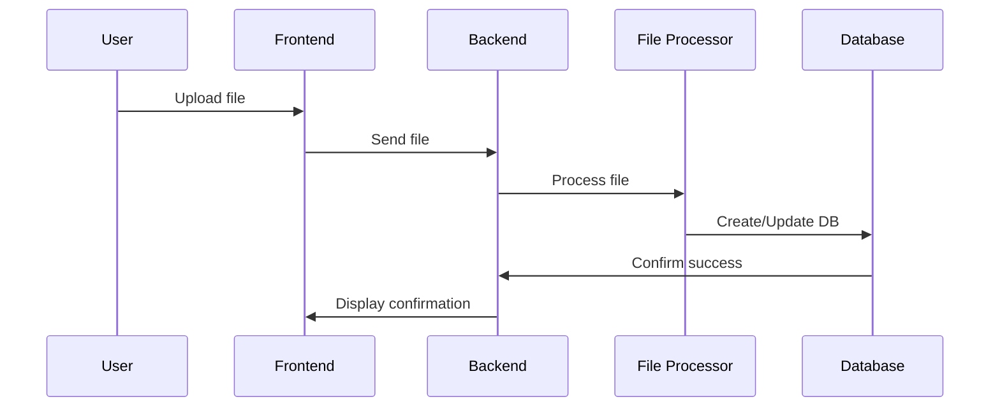
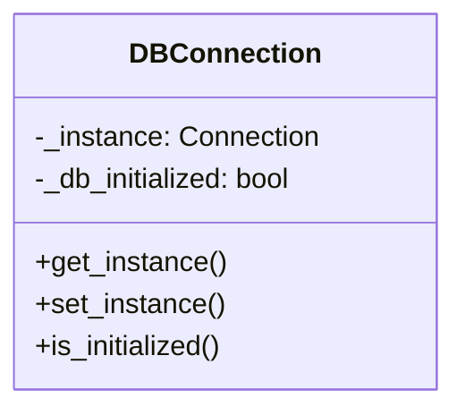

# talk2DB - Natural Language to SQL Query Generator

## Overview
talk2DB is an intelligent database querying system that allows users to interact with databases using natural language. It converts human-readable questions into SQL queries and provides rich data visualization and analysis capabilities.


## Features

### 1. Natural Language Query Processing
- Converts plain English questions to SQL queries
- Supports complex query operations
- Context-aware query generation
- Real-time query validation

### 2. Multi-Database Support
- SQLite
- PostgreSQL
- Excel files (.xlsx, .xls)
- CSV files

### 3. Data Visualization
- Automatic chart suggestions based on data type
- Multiple visualization options:
  - Bar charts
  - Line charts
  - Pie charts
  - Scatter plots
  - Heatmaps

### 4. Advanced Analytics
- Context-aware data analysis
- Statistical insights generation
- Trend detection
- Anomaly identification

### 5. Business Intelligence
- KPI tracking
- Customer segmentation
- Sales analysis
- Performance metrics

## System Architecture



## Data Flow

1. **Input Processing**


2. **File Upload Flow**


## Technical Components

### Backend (Flask)
```python
# Core components
app = Flask(__name__)
CORS(app)

# Database connection management
class DBConnection:
    _instance = None
    _db_initialized = False
```

### API Endpoints

| Endpoint | Method | Description |
|----------|---------|------------|
| `/` | GET | Serve main interface |
| `/upload` | POST | Handle file uploads |
| `/connect-db` | POST | Database connection |
| `/generate-query` | POST | Generate SQL queries |
| `/analyze` | POST | Perform data analysis |
| `/schema` | GET | Get database schema |
| `/report/<report_id>` | GET | Retrieve analysis reports |

### Database Schema Management


## Setup and Installation

### Prerequisites
```bash
python 3.8+
pip
virtualenv
```

### Installation Steps
```bash
# Clone repository
git clone https://github.com/yourusername/talk2DB.git

# Create virtual environment
python -m venv venv
source venv/bin/activate  # On Windows: venv\Scripts\activate

# Install dependencies
pip install -r requirements.txt
```

### Configuration
```python
# Environment variables
GEMINI_API_KEY = 'your-api-key'
UPLOAD_FOLDER = 'uploads'
ALLOWED_EXTENSIONS = {'db', 'xlsx', 'xls', 'csv'}
```

## Usage Examples

### 1. Natural Language Queries
```sql
User: "Show me total sales by product for last month"
Generated SQL: 
SELECT product, SUM(sales) as total_sales 
FROM sales 
WHERE date >= DATE_TRUNC('month', CURRENT_DATE - INTERVAL '1 month')
GROUP BY product;
```

### 2. Data Analysis
```python
# Sample analysis output
{
    "key_findings": [
        {
            "finding": "Sales increased by 25%",
            "confidence": 0.95,
            "statistical_context": "p-value < 0.01"
        }
    ]
}
```

## Security Features

- SQL injection prevention
- File upload validation
- API key authentication
- CORS protection
- Error handling

## Error Handling

```python
try:
    # Operation code
except Exception as e:
    return jsonify({
        'error': str(e),
        'status': 'error'
    }), 500
```

## Testing

```bash
# Run tests
python -m pytest tests/
```

## Performance Optimization

- Connection pooling
- Query caching
- Batch processing
- Async operations

## Contributing

1. Fork the repository
2. Create feature branch
3. Commit changes
4. Push to branch
5. Create Pull Request

## License

MIT License

## Contact

Your Name - your.email@example.com
Project Link: https://github.com/yourusername/talk2DB
